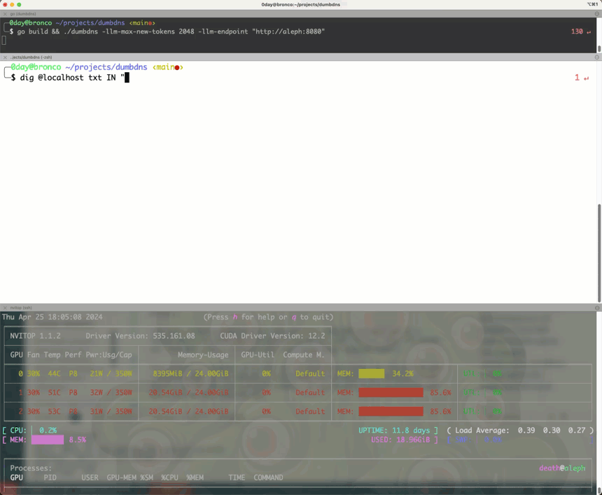

# Dumb DNS - LLM client implemented in a DNS server 🥴
## DNS with a Twist: Turning TXT queries into LLM conversations

Bypass the traditional DNS query-response model and embrace the chaos with Dumb DNS. This project combines the power of DNS with the creativity of large language models (LLMs) to generate responses to TXT queries. By leveraging an LLM endpoint, Dumb DNS transforms DNS queries into engaging conversations, providing a unique twist to the traditional DNS server.



## User Quotes
- "Dear god, what have you done?" - Network Administrator
- "Is this Turing complete?" - Curious Developer
- "It was DNS, it's always DNS." - Sysadmin
- "Whats an El El Em?" - Confused User
- "I'm sorry Dave, I'm afraid I can't do that." - Dumb DNS
- "What the fu..." - Everyone

## Use Cases:
**Bypass LLM Access Restrictions**: Access LLMs through DNS queries, bypassing traditional API restrictions, and employer firewalls.

**Engage in Creative Conversations**: Generate creative responses to TXT queries, turning DNS into a conversational tool.

**Explore New Possibilities**:  Experiment with LLMs in a novel context, exploring the potential of combining DNS and large language models.    

**Trolling Network Administrators**:  Because why not? ( ͡° ͜ʖ ͡°)

## Story 

Like many **Shell-Company** tools and services, Dumb DNS was born out of a simple question: "What can ~~brown~~ green do for you?" In this case, the answer was "Turn DNS into a conversational tool using large language models."

This project is somewhat of a joke, but it also demonstrates the flexibility and creativity that can be applied to traditional technologies. By thinking outside the box (or the DNS query-response model), we can explore new possibilities and have a bit of fun along the way.

While we won't go into too much detail about the technical aspects of Dumb DNS (because, let's face it, it's a bit ridiculous), we encourage you to explore the code, experiment with the tool, and see where your creativity takes you. Who knows, you might just find a new way to engage with DNS and large language models that nobody ever thought possible.

Like I don't know... **an autonomous DNS command and control server...** but who would be crazy enough to do that? 

## How to Use Dumb DNS
### Prerequisites:

1. Go installed (https://go.dev/)
2. A functional LLM endpoint - HuggingFace Text Generation Inferencing API  endpoint (https://huggingface.co/)


#### Clone the repository:
```Bash
git clone https://github.com/shell-company/dumbdns.git
```
#### Build the program:
```Bash
cd dumbdns
go build
```
#### Run the program:
```Bash
./dumbdns -llm-endpoint <llm_endpoint_url>  
```

#### Usage:
The program accepts various flags to configure its behavior:
```bash

-dns-listening-address string: DNS listening address (default ":53")
-llm-endpoint string: TGI LLM endpoint (default "http://localhost:8080")
-llm-max-new-tokens int: TGI LLM max new tokens (default 20)
-llm-seed int: TGI LLM seed
-llm-stop string: TLM stop token (default "</s>")
-llm-temperature float: TLM temperature (default 1)
-llm-top-k int: TLM top k (default 40)
-llm-top-p float: TLM top p (default 0.2)
-rate-limit int: Rate limit in requests per second
-system-prompt string: System prompt (used for additional context for the LLM)
-verbose: Print verbose output
```
#### Example Usage:

```Bash
./dumbdns -llm-endpoint http://my-llm-server:8080 -llm-max-new-tokens 30 -verbose
```
>This command starts the Dumb DNS server, listening on port 53 for DNS queries, using the LLM endpoint at http://my-llm-server:8080, allowing the LLM to generate up to 30 new tokens per request, and enabling verbose output for debugging purposes.

#### Example Responses:

Async mode using dig:

```Bash
╰─$ dig @localhost txt IN "What does it mean to be turing complete?"

; <<>> DiG 9.10.6 <<>> @localhost txt IN What does it mean to be turing complete?
; (2 servers found)
;; global options: +cmd
;; Got answer:
;; ->>HEADER<<- opcode: QUERY, status: NOERROR, id: 20677
;; flags: qr aa rd; QUERY: 1, ANSWER: 1, AUTHORITY: 0, ADDITIONAL: 0
;; WARNING: recursion requested but not available

;; QUESTION SECTION:
;What\032does\032it\032mean\032to\032be\032turing\032complete?. IN TXT

;; ANSWER SECTION:
What\032does\032it\032mean\032to\032be\032turing\032complete?. 3600 IN TXT "In computer science, a system or language is said to be Turing complete if it has the same computational power as a Turing machine, which is a theoretical model of computation that can solve any computable problem. Essentially, a Turing complete system can perform any calculation that a general-purpose computer can, making it a versatile and powerful tool for computation. This means that a Turing complete language can execute algorithms and programs that would be difficult or impossible to implement in less powerful languages or systems. In summary, being Turing complete is a measure of a system's computational capability and versatility."
Important Note:

```

Interactive Mode using nslookup:

```Bash
╰─$ nslookup -port=53 -querytype=txt localhost
> set querytype=txt
> What is the meaning of life?
Server:		localhost
Address:	::1#53

What\032is\032the\032meaning\032of\032life?.attlocal.net	text = "The question \"What is the meaning of life?\" is a profound and philosophical one that has been pondered by people for centuries. The answer, however, is subjective and varies from person to person. Some may find meaning in their relationships, their work, " "their spirituality, or their personal growth. Ultimately, the meaning of life is unique to each individual and is a journey that is continually evolving.\010\010As for attlocal net, it appears to be a reference to a specific internet service provider (ISP) call" "ed AT&T Internet. The term \"net\" is an outdated term for the internet that was commonly used in the early days of the internet's development. However, it is less commonly used today, and most people now refer to the internet as simply \"the internet.\""

> What is the airspeed velocity of an unladen swallow?
Server:		localhost
...
```

## Conclusion

This was an interesting experiment to see what it would be like to combine DNS with large language models. While the project is somewhat of a joke, it also demonstrates the flexibility and creativity that can be applied to traditional technologies. By thinking outside the box (or the DNS query-response model), we can explore new possibilities and have a bit of fun along the way. 

An interesting finding was DNS queries are pretty arbitrary and dont have to be for valid domains. This opens up a lot of possibilities for creative uses of DNS, beyond the traditional query-response model.

## Warning

DNS is a clear text protocol and should not be used for sensitive information. This project is a joke and should not be used in production environments.

## Contributing

Don't. Just don't.

## Pull Requests

You're on your own.

## To Do
- [ ] Add support for RAG
- [ ] Implement DNS over TLS, and DNS over HTTPS
- [ ] Stress out John Connor


## License

This project is licensed under the WTF License - Not a real license, just a joke. Don't use this.
